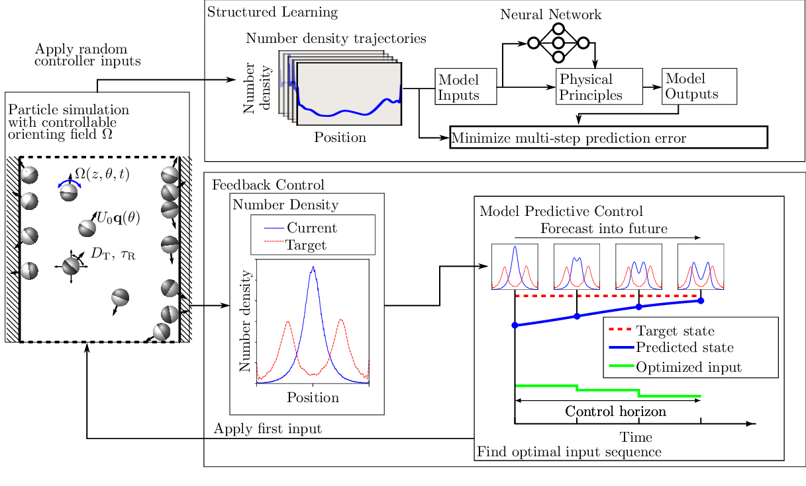
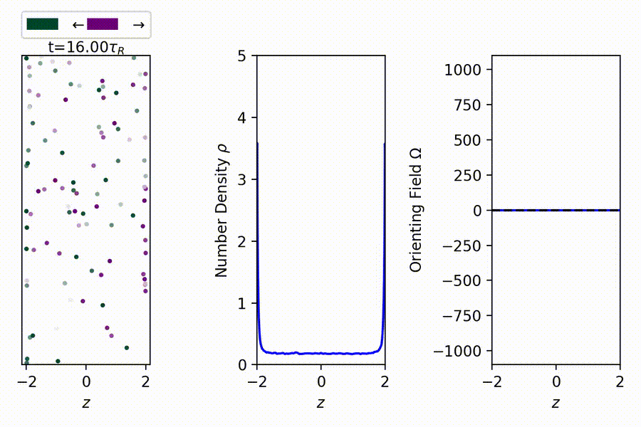
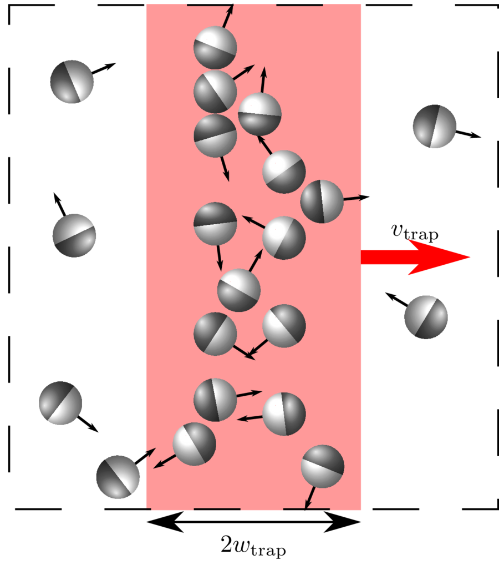

# Gray-box Model Predictive Control framework

  
  
<i>Overview of the gray-box model predictive control framework. The density-only gray-box model is trained on number density trajectories (top) from a Brownian dynamics (BD) simulation of active Brownian particles (ABPs) with a controllable orienting field (left). The learned gray-box model is then used in Model Predictive Control (MPC) to split the particles into two populations (bottom).</i>

# Gray-box MPC for noninteracting ABPs
## System: Magnetic-like actuator on Active Brownian Particles

  
  
<i> The particles in the BD simulation (left) are colored by their orientation as indicated by the legend. The number density (middle) corresponds to the BD simulation. The input torque (right) is the control signal for the magnetic-like actuator and starts with a step that orients particles to the center, then negative to orient particles to the left, and finally positive orient particles to the right. There are no flux boundary conditions at the walls, i.e. the ABPs are confined.
	</i>

## Training trajectory

    
  
<i>Training trajectory for noninteracting ABPs with confinement and Peclet number=2. Random orienting fields (right) are applied to the BD simulation (left). The number density trajectory (second from left) corresponds to the BD simulation and is used to train the gray-box model. The polar order (second from right) is the term the gray-box model predicts, but is not used in the training.
	</i>

## Testing trajectory

    
  
<i>Testing the gray-box model (noninteracting). The gray-box model is tested on a new set of random orienting fields (right) applied to the BD simulation (left). The blue and red number density trajectory (second from left) corresponds to the BD simulation and the gray-box model, respectively. The polar order (second from right) shows a comparison between measured and predicted polar orders. 
	</i>

## Gray-box MPC to split and juggle population of ABPs

    
  
<i>The objective is to split the particles into two populations centered about the the two red dashed vertical lines in the BD simulation (left) and number density trajectory (second from left), while tracking the target fraction of particles left of the origin (right). The orienting field (second from right) is the first input from MPC.
	</i>

# Gray-box MPC for interacting active hard disks
## Noninteracting vs. active hard disks

    
  
<i>Comparing noninteracting (left) and active hard disks (right) subject to the same orienting fields without confinement, i.e. periodic boundary conditions. Yellow particles are for visual emphasis. Active hard disks have excluded volume interactions with one another.
	</i>

## Training trajectory

    
  
<i>Training trajectory for active hard disks with Peclet number=100, volume fraction of 40% and no confinement. Random orienting fields (right) are applied to the BD simulation (left). The number density trajectory (second from left) corresponds to the BD simulation and is used to train the gray-box model.
	</i>

## Testing trajectory

    
  
<i>Testing the gray-box model against active hard disks BD simulation. The gray-box model is tested on a new set of random orienting fields (right) applied to the BD simulation (left). The blue and red number density trajectory (second from left) corresponds to the BD simulation and the gray-box model, respectively. The effective force (second from right) shows only the predicted polar order. 
	</i>

## Gray-box MPC to split and juggle population of active hard disks

    
  
<i>Controlling active hard disks with gray-box MPC. The objective is to split the particles into two populations centered about the the two red dashed vertical lines in the BD simulation (left) and number density trajectory (second from left), while tracking the target fraction of particles left of the origin (right). The orienting field (second from right) is the first input from MPC.
	</i>

## Fastest trap problem for active hard disks

    
  
<i>Illustration of the fastest trap problem for active hard disks. Particles within the red shaded region are considered trapped. The goal is to move the trap rightward as quickly as possible while maintaining a minimum trapped population.
	</i>

## Gray-box MPC for the fastest trap problem

    
  
<i>Gray-box MPC for the fastest trap problem with a minimum trap fraction of 70%. BD simulation (left) and number density trajectory (second from left) show the particles moving rightward. The trap center is marked by the red dashed line while the trap area is the shaded region. The orienting field (second from right) is the control signal from MPC. The trapped particle fraction achieved by MPC (right) is shown to remain above the minimum threshold.
	</i>

