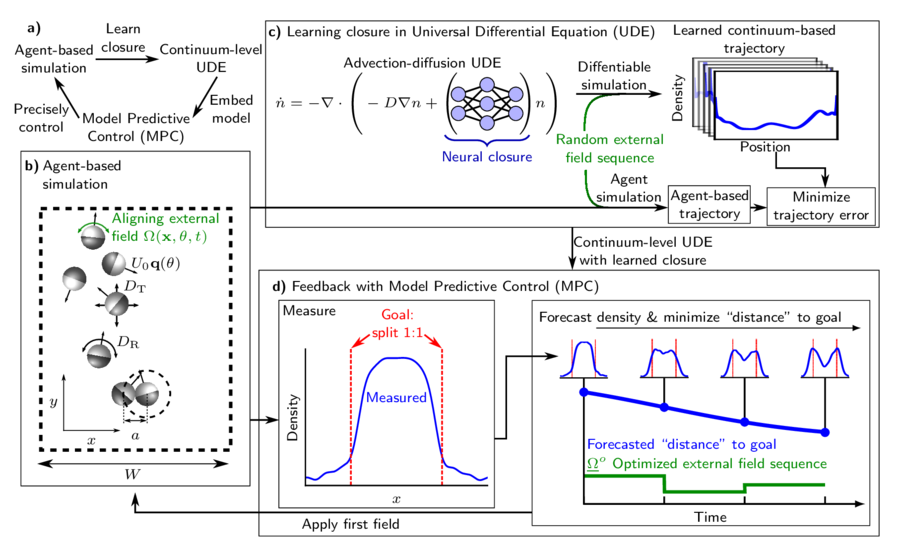
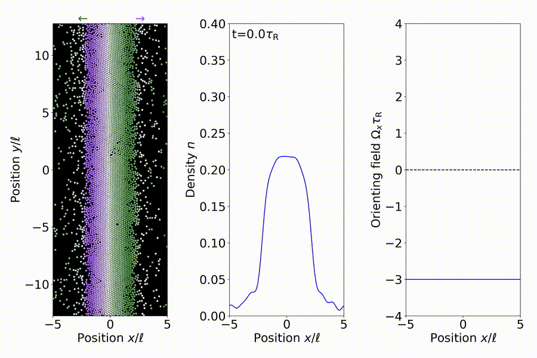
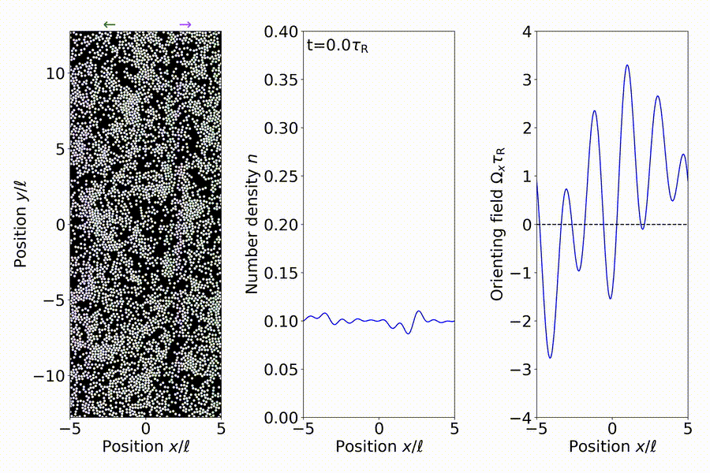
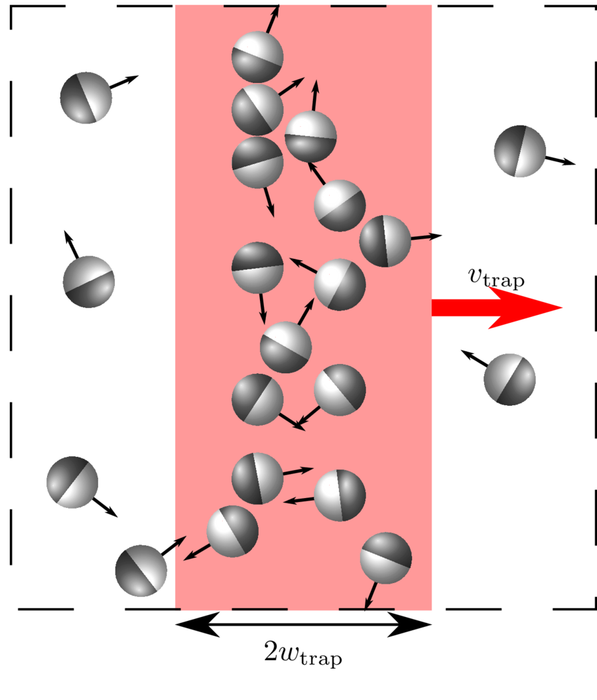

  

  

    <a href="https://github.com/titusswsquah/graybox_abp_mpc" class="resource-link github-link">
      <svg height="24" width="24" viewBox="0 0 16 16" fill="currentColor">
        <path d="M8 0C3.58 0 0 3.58 0 8c0 3.54 2.29 6.53 5.47 7.59.4.07.55-.17.55-.38 0-.19-.01-.82-.01-1.49-2.01.37-2.53-.49-2.69-.94-.09-.23-.48-.94-.82-1.13-.28-.15-.68-.52-.01-.53.63-.01 1.08.58 1.23.82.72 1.21 1.87.87 2.33.66.07-.52.28-.87.51-1.07-1.78-.2-3.64-.89-3.64-3.95 0-.87.31-1.59.82-2.15-.08-.2-.36-1.02.08-2.12 0 0 .67-.21 2.2.82.64-.18 1.32-.27 2-.27.68 0 1.36.09 2 .27 1.53-1.04 2.2-.82 2.2-.82.44 1.1.16 1.92.08 2.12.51.56.82 1.27.82 2.15 0 3.07-1.87 3.75-3.65 3.95.29.25.54.73.54 1.48 0 1.07-.01 1.93-.01 2.2 0 .21.15.46.55.38A8.013 8.013 0 0016 8c0-4.42-3.58-8-8-8z"/>
      </svg>
      View on GitHub
    </a>
    
    <a href="https://arxiv.org/abs/2501.18809" class="resource-link arxiv-link">
      <svg height="24" width="24" viewBox="0 0 24 24" fill="currentColor">
        <path d="M19 3H5c-1.1 0-2 .9-2 2v14c0 1.1.9 2 2 2h14c1.1 0 2-.9 2-2V5c0-1.1-.9-2-2-2zm-3 14H8c-.55 0-1-.45-1-1s.45-1 1-1h8c.55 0 1 .45 1 1s-.45 1-1 1zm0-4H8c-.55 0-1-.45-1-1s.45-1 1-1h8c.55 0 1 .45 1 1s-.45 1-1 1zm0-4H8c-.55 0-1-.45-1-1s.45-1 1-1h8c.55 0 1 .45 1 1s-.45 1-1 1z"/>
      </svg>
      Read on arXiv
    </a>
  

# Gray-box Model Predictive Control framework

  
  
<i>Physics-informed machine learning framework for modeling and control of interacting active matter.
    (a) Schematic of interacting active Brownian particles (ABPs) in 2D. The particles exhibit complex dynamics due to multibody interactions and correlated particle behavior. As a case study, in this work we use Brownian dynamics simulations of active particles with controllable angular velocities from an spatiotemporal external torque. 
    More generally, our framework may be applied to systems where the particle density is observable or can be estimated, including microscopy images of controllable active particles.
    (b) The gray-box modeling framework combines physics-informed machine learning with a neural operator to learn a closure model for multibody interactions, enabling the prediction of density dynamics. The predictive model is trained to align closely with observed system behavior, leveraging past state and input data. 
    (c) The gray-box model is integrated into a Model Predictive Control (MPC) framework, where it is used to control emergent behaviors. MPC optimizes the control inputs to achieve user-defined objectives, such as splitting the particle population into groups or dynamically controlling fluxes. Our framework can handle complex particle interactions and optimize control actions for precise and adaptive manipulation of active matter.
  </i>

# Gray-box MPC for interacting ABPs
## System: Magnetic-like actuator on Active Brownian Particles

  
  
<i> The particles in the BD simulation (left) are colored by their orientation as indicated by the legend. The number density (middle) corresponds to the BD simulation. The input torque (right) is the control signal for the magnetic-like actuator and starts with a step that orients particles to the center, then negative to orient particles to the left, and finally positive orient particles to the right. There are periodic boundary conditions at the walls.
	</i>

## Training trajectory

    
  
<i>Training trajectory for active hard disks with Peclet number=100, volume fraction of 40% and no confinement. Random orienting fields (right) are applied to the BD simulation (left). The number density trajectory (second from left) corresponds to the BD simulation and is used to train the gray-box model.
	</i>

## Testing trajectory

    
  
<i>Prediction accuracy of the gray-box model over a 100 τR time horizon using testing data. (a) The L2 norm of the error between the predicted and measured number densities remains below 0.01 throughout the simulation, indicating a close match to the true number density profile. X-marks indicate points where the actuator field changes. (b) Snapshots of the particle simulation are shown for six time points: t=[0τR, 20τR, 40τR, 60τR, 80τR, 99τR]. Particles are colored based on their polar order in the x direction, normalized by density, mx(x)/n(x), where mx(x) = ∫∫ cos(θ)P(x, θ, t),dθ,dy. Positive polar order (particles oriented to the right) is shown in purple, while negative polar order (particles oriented to the left) is shown in green. Regions without strong polar order are colored white. Colored arrows above the particles are included for visual clarity. (c) Snapshots of the number density field for both measured (blue) and predicted (red) values are shown for the same six time points as in (b). (d) The advective flux due to the velocity field vxn is displayed for measured (blue) and predicted (red) values, with fluctuations attributed to particle collisions. (e) The actuating field applied during the simulation is shown for context.
	</i>

## Gray-box MPC to split and juggle population of active hard disks

    
  
<i>Splitting and juggling the population of ABPs. The steps are as follows: (1) Split particles into two equal groups centered at x+ and x-; (2) Achieve a distribution where 30% of the particles are to the left of the origin while maintaining the populations centered at x+ and x-; (3) Repeat step 2 with 70% of the particles to the left of the origin; and (4) Return to step 1. (a) The sum of the mean squared distances (MSDs) of particles to their respective set points, x+ and x-, is plotted. (b) The target fraction of particles to the left of the origin (red line) and the realized fraction under Model Predictive Control (MPC) (blue line) are shown. (c) Particle simulation. Particles are colored based on their expected orientation in the x direction, averaged over the y direction: purple indicates particles oriented to the right, green indicates particles oriented to the left, and white indicates no strong orientation. Red dashed lines mark the set points x+ and x-. Colored arrows above the particles guide the eye. (d) Number density field. (e) Polar order field. (f) The actuating field applied to the system, extracted from the first input in the MPC sequence, is displayed.
	</i>

## Fastest trap problem for active hard disks

    
  
<i>Illustration of the fastest trap problem for active hard disks. Particles within the red shaded region are considered trapped. The goal is to move the trap rightward as quickly as possible while maintaining a minimum trapped population.
	</i>

## Gray-box MPC for the fastest trap problem

    
  
<i>Fastest trap with nmin=0.6 and wtrap=4. 
    (a) Trapped fraction ntrap(t) (blue) compared to the minimum fraction nmin (red dashed line).
    (b) Trap velocity vtrap over time.
    (c) Particle simulation snapshots with particles colored by expected orientation: green (left) and purple (right). The trap center is indicated by the red dashed line, and the trapped region is shaded in red.
    (d) Density field of the particles. 
    (e) Polar order field showing the particle orientation. 
    (f) Actuator field.
	</i>

## Advective flux control

    
  
<i>Simultaneous control of particle number density and mean flux using gray-box MPC. (a) The set point mean flux (dashed red line) and measured flux (solid blue line) show accurate tracking throughout the sinusoidal profile. (b) Particle positions and polar order at representative times, highlighting leftward (green) and rightward (purple) orientations. (c) Density profiles consistently accumulate near x±, indicating the successful maintenance of the target accumulation. (d) Flux profiles confirm precise mean flux control, with measured mean flux (solid blue line) matching the set point (dashed red line). (e) Actuator field snapshots reveal dynamic control strategies, including field modulation to achieve target fluxes, paired with localized jamming around x± to maintain density accumulation about x±. Red dashed vertical lines indicate target particle accumulation points, emphasizing the controller's ability to simultaneously regulate both number density and flux across the domain.
	</i>

